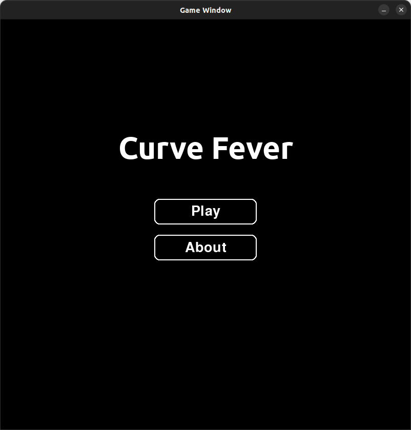
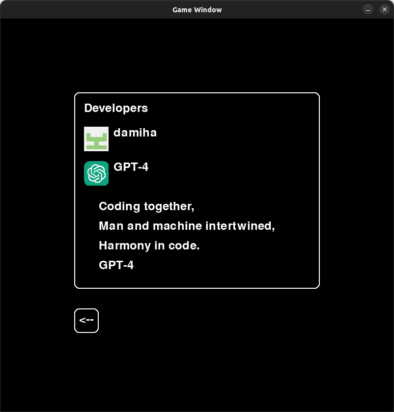
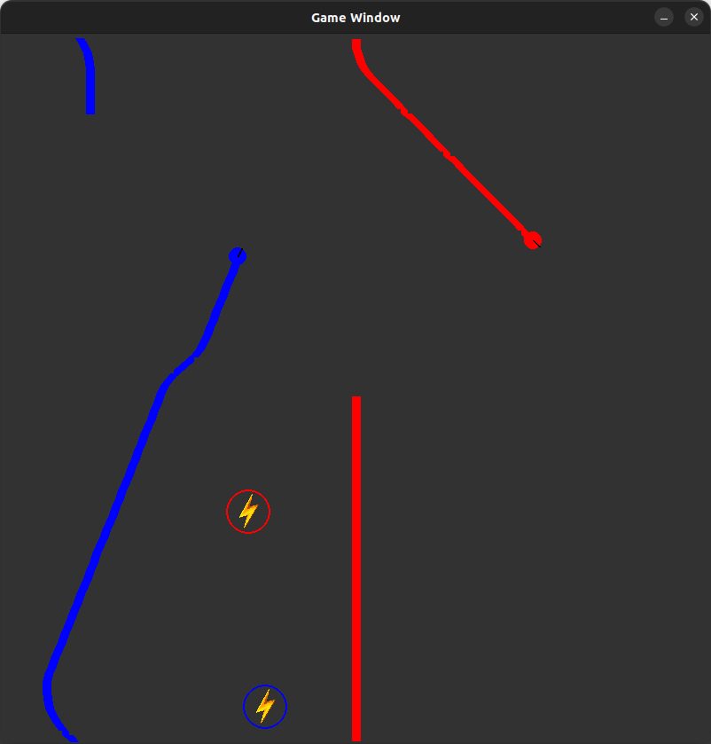

# Curve Fever Clone With GPT-4

## Project Overview

"Curve Fever Clone With GPT-4" is a project that aims to recreate the popular multiplayer snake-like game "Curve Fever" with enhanced features and functionalities. The entire codebase for this project was developed in approximately 4 hours with the assistance of GPT-4, showcasing the efficiency and effectiveness of AI-assisted coding.

## Screenshots

Here are some screenshots demonstrating different aspects of the game:

### Main Menu

*The main menu of the game, featuring options to play or learn more about the game.*

### About Screen

*The about screen, detailing the developers and additional information.*

### In-Game Experience

*A snapshot of the gameplay, capturing the excitement of Curve Fever.*

### Game Over Screen

*The game over screen, displaying the results and options post-game.*

## Conclusion

This project demonstrates the capabilities of AI-assisted software development, significantly reducing development time and allowing for rapid prototyping and iteration.

---

*This README.md was also created with the assistance of GPT-4.*
